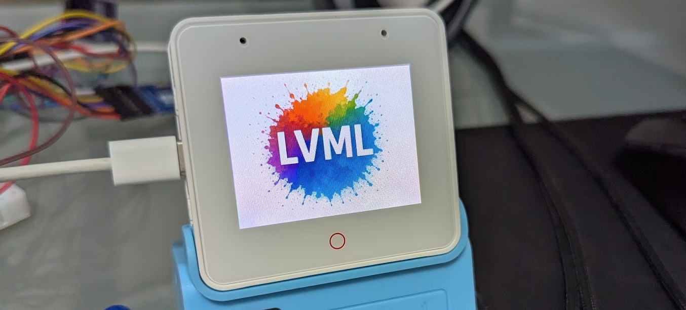

# LVML Demo - LVGL XML Component System

## What is LVML?

**LVML** is a powerful combination of **LVGL XML Component System** and **web server integration** that revolutionizes embedded UI development. This approach enables dynamic UI updates without firmware recompilation by loading UI definitions from web servers at runtime.



## 🎯 The LVML Concept

LVML combines the best of both worlds:
1. **LVGL's XML Component System** - Clean, declarative UI definitions using XML syntax
2. **Web server integration** - Remote UI management and updates via HTTP
3. **Dynamic loading** - Runtime UI changes without firmware updates
4. **Scalable architecture** - Manage multiple devices from central servers

This creates a **web-like development workflow** for embedded systems, where developers can:
- Write UIs in **readable XML** instead of verbose C code
- **Serve UIs from web servers** using familiar HTTP protocols
- **Update device interfaces remotely** without touching firmware
- **Scale to many devices** with centralized UI management

## 🚀 Why LVML Matters

Traditional embedded UI development requires:
- Writing UI code in C/C++
- Recompiling firmware for every UI change
- Uploading new firmware to devices
- Managing UI code scattered across multiple projects

**LVML eliminates these pain points** by providing:
- **Declarative UI definition** in XML format
- **Remote UI updates** via HTTP
- **No firmware recompilation** for UI changes
- **Centralized UI management** for multiple devices

## 🎯 Demo Goals

This project serves as a **practical example** of LVGL's XML Component System, showing developers how to:
1. **Write LVGL UIs in XML format** - Clean, readable, maintainable
2. **Integrate with web servers** - Remote UI management and updates
3. **Create dynamic, updatable interfaces** - Change UI without touching firmware
4. **Leverage LVGL's component system** - Reusable UI components with event handling

## 🚀 Key Demonstrations

### 1. LVGL XML Component System
- **Component-based UI definition** using XML syntax
- **Event binding** with `<lv_event-call_function>` elements
- **Styling and layout** using LVGL's XML attributes
- **Nested object hierarchy** for complex UI structures
- **Dynamic screen navigation** between XML-defined screens

### 2. Web Server Integration
- **HTTP-based UI loading** from remote server
- **Dynamic content delivery** without firmware updates
- **Real-time UI modifications** by updating XML files on server
- **Scalable UI management** for multiple devices

### 3. Runtime UI Updates
- **Hot-swappable screens** loaded on-demand
- **Memory-efficient UI switching** with proper cleanup
- **Event-driven navigation** between different XML-defined screens
- **Automatic memory management** for screen transitions

## 🏗️ Architecture

### Hardware
- **Board**: ESP32-S3 Box 3
- **Display**: 320x240 TFT with ILI9342 driver
- **Touch**: GT911 capacitive touch controller
- **Memory**: 16MB PSRAM for efficient buffer management
- **Storage**: 1MB LittleFS filesystem

### Software Stack
- **Framework**: Arduino + PlatformIO
- **Graphics**: LVGL 9.3.0 with XML Component System
- **UI Definition**: LVGL XML Component System
- **Network**: WiFi + HTTP client for dynamic content loading
- **Touch**: GT911 driver with interrupt support

## 📁 Project Structure

```
├── src/
│   └── main.cpp              # Main firmware with LVGL XML loader
├── lvml_web/                 # XML UI definitions
│   ├── main.xml             # Initial screen with Next button
│   ├── step1.xml            # Second screen with navigation
│   ├── step2.xml            # Third screen with title and navigation
│   └── step3.xml            # Final screen with completion message
├── include/                  # Configuration headers
│   ├── lv_conf.h            # LVGL configuration
│   ├── WifiConfig.h         # WiFi credentials
│   ├── GT911_Setup.h        # Touch controller setup
│   ├── Setup252_ESP32_S3_Box_3.h  # TFT display configuration
│   └── pins_arduino.h       # Pin definitions
├── boards/                   # Board-specific configurations
├── platformio.ini           # PlatformIO configuration
├── partitions.csv            # ESP32 partition table
└── README.md                # This file
```

## 🔧 Setup Instructions

### Prerequisites
- PlatformIO IDE or CLI
- ESP32-S3 Box 3 development board
- WiFi network access
- HTTP server to host XML files

### 1. Clone the Repository
```bash
git clone git@github.com:liusida/LVML-demo.git
cd LVML-demo
```

### 2. Configure WiFi
Create `include/WifiConfig.h` (or copy from template):
```cpp
#ifndef WIFI_CONFIG_H
#define WIFI_CONFIG_H

#define WIFI_SSID "Your_WiFi_SSID"
#define WIFI_PASSWORD "Your_WiFi_Password"

#endif
```

### 3. Configure HTTP Server
Set up a web server to serve the XML files from the `lvml_web/` directory.

Example Python server:
```bash
cd lvml_web
python -m http.server 8866
```

**Important**: Update the `server_url` in `src/main.cpp` to match your server's IP address and port.

### 4. Build and Upload
```bash
# Build the project
pio run

# Upload to ESP32-S3 Box 3
pio run --target upload

# Monitor serial output
pio device monitor
```

## 📱 UI Screens

### Main Screen (`main.xml`)
- Simple interface with a "Next" button
- Demonstrates basic LVGL XML structure
- Includes event binding for dynamic navigation

### Step 1 Screen (`step1.xml`)
- Navigation interface with "Main" and "Next" buttons
- Shows nested object structure with colored background
- Demonstrates styling and positioning

### Step 2 Screen (`step2.xml`)
- Enhanced layout with title and three navigation buttons
- Shows "Back", "Home", and "Next" navigation options
- Demonstrates more complex UI structure

### Step 3 Screen (`step3.xml`)
- Final destination screen with completion message
- Includes subtitle and navigation back to previous screens
- Shows full navigation flow capabilities

## 🔌 Dynamic Loading System

The firmware implements a sophisticated dynamic UI loading system:

1. **Initial Load**: Loads `main.xml` from the web server
2. **Screen Navigation**: Dynamically loads new screens based on user interaction
3. **Memory Management**: Properly cleans up previous screens before loading new ones
4. **Error Handling**: Graceful fallback if XML loading fails
5. **Component Registration**: Each screen is registered as a unique component for memory efficiency

### Key Features:
- **HTTP-based XML loading** from remote servers
- **Automatic screen cleanup** to prevent memory leaks
- **Unique component naming** for each loaded screen
- **Event-driven navigation** between screens
- **Touch input integration** with GT911 controller

## 🚀 Features

- **Dynamic UI Loading**: Load UI definitions from web servers at runtime
- **Touch Support**: Full capacitive touch integration with GT911 controller
- **WiFi Connectivity**: Seamless network integration for remote UI updates
- **Memory Efficient**: Optimized memory usage with PSRAM support and proper cleanup
- **Cross-Platform**: Works with any HTTP server and client devices
- **Real-time Updates**: Modify UI by updating XML files on the server

## 🔍 Technical Details

### LVGL XML Component System
- Custom XML parser for LVGL component system
- Event binding and callback management with `<lv_event-call_function>`
- Dynamic object creation and destruction
- Memory-efficient screen switching with component registration

### Network Layer
- HTTP client implementation for XML fetching
- Configurable server URL for easy deployment
- Automatic retry mechanisms for network failures
- Support for both HTTP and HTTPS (with proper certificates)

### Memory Management
- PSRAM utilization for display buffers
- Automatic cleanup of previous UI components
- Efficient memory allocation for screen transitions
- LittleFS filesystem support for local storage

## 🎮 Navigation Flow

The demo showcases a complete navigation system:

```
main.xml → step1.xml → step2.xml → step3.xml
    ↑         ↑          ↑          ↑
    └─────────┴──────────┴──────────┘
         (Back/Home navigation)
```

Each screen demonstrates different aspects of the LVGL XML system:
- **Event handling** with click callbacks
- **Dynamic screen loading** from web server
- **Memory management** during transitions
- **UI component reuse** and cleanup

## 🤝 Contributing

We welcome contributions! Please feel free to:
- Report bugs and issues
- Suggest new features
- Submit pull requests
- Improve documentation
- Add new XML screen examples

## 📄 License

This project is licensed under the MIT License - see the [LICENSE](LICENSE) file for details.

## 🙏 Acknowledgments

- **LVGL Team** for the excellent graphics library and XML Component System
- **ESP32 Community** for the robust hardware platform
- **PlatformIO** for the excellent development environment
- **GT911 Library** contributors for touch controller support

---

**LVML Demo** - Bringing web-like development to embedded displays! 🚀

*Experience the power of dynamic UI updates with LVGL XML and web server integration.*